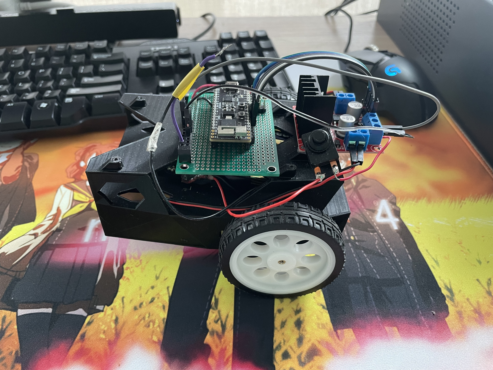
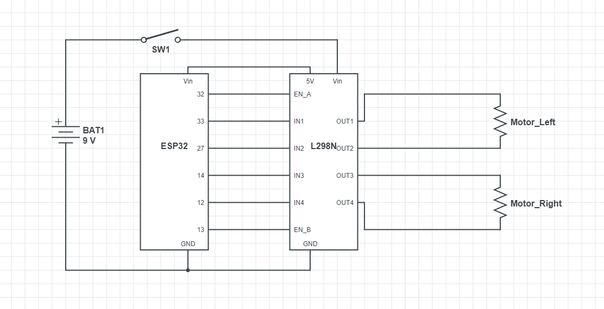
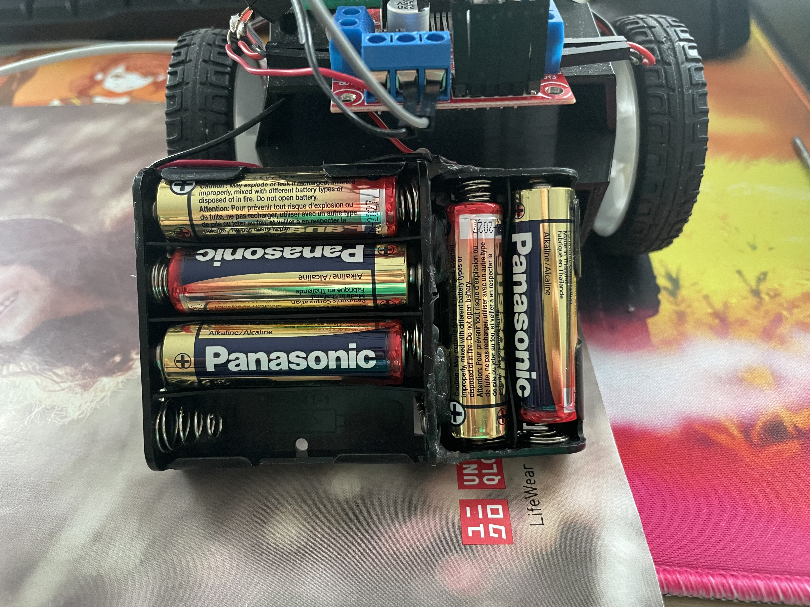

# BLE_Remote_Control_Robocar

ESP32 Remote control car by BLE via Dabble

## Objective: Build a wireless controlled robocar toy, reusing the chassis from a class project remaining. 

## Materials:
1.	ESP32 Pico
2.	L298N Motor Driver
3.	A switch button
4.	9v battery
5.	2 Generic TT DC motor
6.	2 Wheels
7.	A Ball Caster

## Schematics:

## Demo: 

I combined two battery cases to be able to use AA battery as 9V battery. The case is inherited from class project as well, and you dont have to use exact 9V in this project. Any voltage source from 7 to 12V is okay. 

